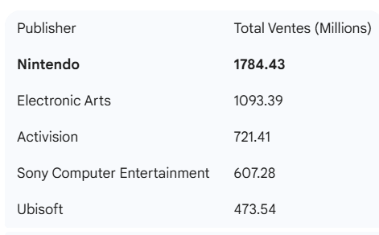

# 🎮 Azure Data Engineering : Analyse des Ventes de Jeux Vidéo

Ce projet présente un pipeline de données complet (ETL) réalisé sur Microsoft Azure. L'objectif est d'ingérer des données brutes de ventes de jeux vidéo, de les nettoyer, de les stocker de manière structurée et d'en extraire des indicateurs clés de performance.

## 👥 Équipe du projet
* **TCHATCHOUA NJANJO LIONEL**
* **NDIAYE SERIGNE MBACKE**
* **FOMENA TSATSOP JOEL VALDES**

## 🏗️ Architecture du Projet

Le projet suit une architecture moderne de Data Engineering en 4 étapes clés :

1.  **Ingestion :** Stockage du fichier CSV brut (`vgsales.csv`) dans **Azure Blob Storage**.
2.  **Stockage Structuré :** Provisionnement d'une **Azure SQL Database** pour recevoir les données propres.
3.  **ETL & Transformation :** Utilisation d'**Azure Data Factory** (Data Flow) pour nettoyer les données (filtrage des valeurs "N/A") avant insertion.
4.  **Analyse :** Exécution de requêtes SQL pour visualiser les résultats (ex: Top 5 des éditeurs).

---

## 🛠️ Ressources Azure Déployées

* **Resource Group :** `ProjetAzureRG`
* **Storage Account :** `stockagevideogames2024` (Conteneur : `source-data`)
* **Azure SQL Database :** `VideoGamesDB` (Serveur : `srv-games-2024`)
* **Azure Data Factory :** `adf-videogames-2024`

---

## 🚀 Étapes de mise en œuvre

### Étape 1 : Base de données (SQL)
La table cible `JeuxVideo` a été créée avec le schéma suivant pour accueillir les données typées :

```sql
CREATE TABLE JeuxVideo (
    Rank INT,
    Name NVARCHAR(200),
    Platform VARCHAR(50),
    Year VARCHAR(10),
    Genre VARCHAR(50),
    Publisher NVARCHAR(100),
    NA_Sales DECIMAL(10, 2),
    EU_Sales DECIMAL(10, 2),
    JP_Sales DECIMAL(10, 2),
    Other_Sales DECIMAL(10, 2),
    Global_Sales DECIMAL(10, 2)
);
```
Étape 2 : Pipeline ETL (Azure Data Factory)Un Data Flow a été créé pour transformer les données brutes :Source : Fichier CSV dans le Blob Storage.Transformation (Filtre) : Suppression des lignes où l année est invalide.Expression : Year != 'N/A'Sink (Destination) : Insertion automatique dans la table Azure SQL JeuxVideo.📊 Analyse des DonnéesUne fois le pipeline exécuté avec succès, nous avons effectué des analyses SQL pour répondre à des questions métier.

Requête : Top 5 des Éditeurs par volume de ventes mondial
```SQL
SELECT TOP 5 Publisher, SUM(Global_Sales) as Total_Ventes_Millions
FROM JeuxVideo
GROUP BY Publisher
ORDER BY Total_Ventes_Millions DESC;
```

Résultats obtenus





📂 Documentation
Le rapport complet avec les captures d écran étape par étape est disponible dans le fichier Rapport_Azure_TCHATCHOUA_FOMENA_NDIAYE.pdf
